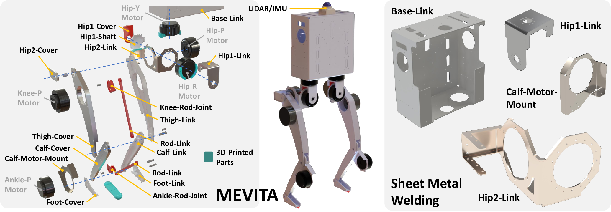

# MEVITA
This repository includes the hardware and software components of "MEVITA: Open-Source Bipedal Robot Assembled from E-Commerce Components via Sheet Metal Welding."

Please refer to the following links for more information.
- [Project Page](https://haraduka.github.io/mevita-hardware)
- [arXiv](https://arxiv.org/abs/2508.17684)
- [YouTube](https://www.youtube.com/watch?v=_akfHkCne0s)

# Hardware

You can find all the hardware components in the following link
- [Goodle Drive](https://drive.google.com/drive/folders/1PlmsZT_c0rvLUOtIdCrQJ9vXPVhtB7AJ?usp=sharing)



From the link of RUBIK LINK V2.0, please download the upper computer installation program and make all the motors MIT mode.
- [AK70-10](https://www.cubemars.com/goods-1031-AK70-10.html)
- [AK10-9 V2.0](https://www.cubemars.com/goods-1141-AK10-9+V20+KV60.html)
- [AK Serials Manual](https://www.cubemars.com/images/file/20240611/1718085712815162.pdf)
- [RUBIK LINK V2.0](https://www.cubemars.com/goods-1140-RUBIK+LINK+V20.html)
- Motor Order: L(6-10) --> R(1-5)  / Proximal --> Distal
- Link Name: L_hip1_link --> L_hip2_link --> L_thigh_link --> L_calf_link --> L_foot_link
- Joint Name: L_hip_y --> L_hip_r --> L_hip_p --> L_knee_p --> L_ankle_p

# Software Dependencies
Please install the following dependencies.
- [ROS](https://www.ros.org/)
- [legged_gym](https://github.com/leggedrobotics/legged_gym)
- [livox_ros_driver2](https://github.com/tongtybj/livox_ros_driver2/tree/PR/ros1)
- [FAST_LIO](https://github.com/tongtybj/FAST_LIO/tree/PR/odometry) # optional
- [spacenav_node](https://wiki.ros.org/spacenav_node) # optional
- [virtual_joystick](https://github.com/aquahika/rqt_virtual_joystick) # optional

Please install the following python packages.
- bitstring
- pytorch
- scipy
- mujoco
- mujoco-python-viewer
- urdf_parser_py
- ds4drv (optional)

# Build
```
mkdir -p ~/mevita_ws/src
cd ~/mevita_ws/src
git clone git@github.com:haraduka/mevita.git
cd ..
catkin build
source ~/mevita_ws/devel/setup.bash
```

## Setup Can Devices
```
udevadm info -a -p /sys/class/net/can0 | grep serial # you can get ATTRS{serial}=="004000235457530120353930"

# see config/99-usb-can.rules
sudo vim /etc/udev/rules.d/99-usb-can.rules

# add the below command
SUBSYSTEM=="usb", ATTRS{serial}=="004000235457530120353930", SYMLINK+="can_usb_0"
SUBSYSTEM=="usb", ATTRS{serial}=="004000265457530120353930", SYMLINK+="can_usb_1"

# then (please plug out and in the device)
sudo udevadm control --reload-rules
sudo udevadm trigger
```

# Reinforcement Learning
```
# in legged_gym
git remote add haraduka git@github.com:haraduka/legged_gym.git
git fetch haraduka
git checkout haraduka/mevita

python3 legged_gym/scripts/train.py --task mevita
python3 legged_gym/scripts/play.py --task mevita --load_run ( log_dir )
cp logs/mevita/( log_dir )/exported/policies/policy_1.pt /tmp/policy.pt
roscd mevita
cp /tmp/policy.pt models/policy.pt
```

# Usage
Please test several codes by running the following command.
```
python3 scripts/mevita_utils.py
```
Please test the motors by running the following command.
```
./bin/can_setup.sh
python scripts/tmotor_test.py --device can0 --ids 1 --task sense
```
Please test the real robot by running the following command.
```
# in the PC of MEVITA
roscore
sudo ds4drv
roslaunch mevita livox.launch
./bin/can_setup.sh
python3 scripts/mevita_main.py

# Cross: SITDOWN/STANDUP, Circle: STANDUP/WALK for ps4joy
```

If you want to simulate the robot in mujoco
```
python3 scripts/mevita_main.py --sim

# please press D to turn off every-step rendering in mujoco viewer
```

# Acknowledgements
- scripts/tmotor_lib.py is from [mini-cheetah-tmotor-python-can](https://github.com/dfki-ric-underactuated-lab/mini-cheetah-tmotor-python-can)
- scripts/isaacgym_torch_utils.py is from [IsaacGym](https://developer.nvidia.com/isaac-gym)
- scripts/legged_gym_math.py is from [LeggedGym](https://github.com/leggedrobotics/legged_gym)

# Citation
```
@inproceedings{kawaharazuka2025mevita,
  author={K. Kawaharazuka and S. Sawaguchi and A. Iwata and K. Yoneda and T. Suzuki and K. Okada},
  title={{MEVITA: Open-Source Bipedal Robot Assembled from E-Commerce Components via Sheet Metal Welding}},
  booktitle={Proceedings of the 2025 IEEE-RAS International Conference on Humanoid Robots},
  year=2025,
}
```
